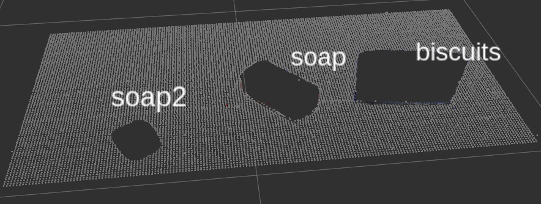
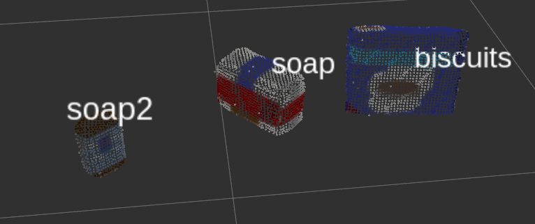
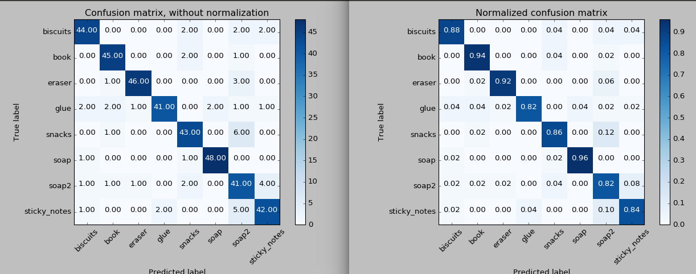
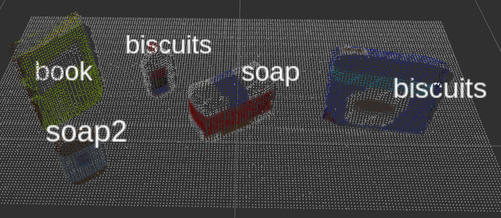
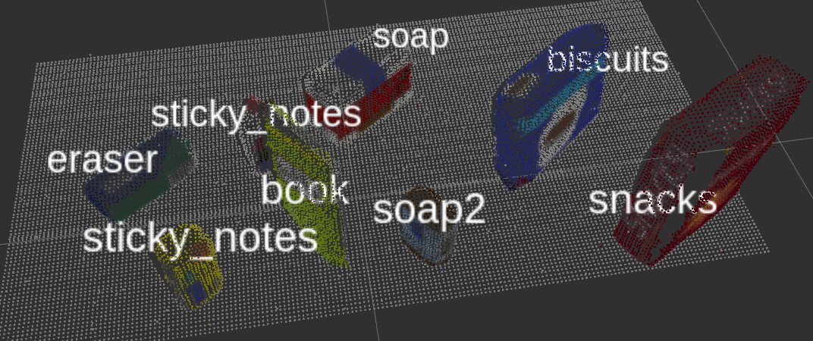

## Project: Perception Pick & Place
### Writeup Template: You can use this file as a template for your writeup if you want to submit it as a markdown file, but feel free to use some other method and submit a pdf if you prefer.

---


# Required Steps for a Passing Submission:
1. Extract features and train an SVM model on new objects (see `pick_list_*.yaml` in `/pr2_robot/config/` for the list of models you'll be trying to identify).
2. Write a ROS node and subscribe to `/pr2/world/points` topic. This topic contains noisy point cloud data that you must work with.
3. Use filtering and RANSAC plane fitting to isolate the objects of interest from the rest of the scene.
4. Apply Euclidean clustering to create separate clusters for individual items.
5. Perform object recognition on these objects and assign them labels (markers in RViz).
6. Calculate the centroid (average in x, y and z) of the set of points belonging to that each object.
7. Create ROS messages containing the details of each object (name, pick_pose, etc.) and write these messages out to `.yaml` files, one for each of the 3 scenarios (`test1-3.world` in `/pr2_robot/worlds/`).  [See the example `output.yaml` for details on what the output should look like.](https://github.com/udacity/RoboND-Perception-Project/blob/master/pr2_robot/config/output.yaml)  
8. Submit a link to your GitHub repo for the project or the Python code for your perception pipeline and your output `.yaml` files (3 `.yaml` files, one for each test world).  You must have correctly identified 100% of objects from `pick_list_1.yaml` for `test1.world`, 80% of items from `pick_list_2.yaml` for `test2.world` and 75% of items from `pick_list_3.yaml` in `test3.world`.
9. Congratulations!  Your Done!

# Extra Challenges: Complete the Pick & Place
7. To create a collision map, publish a point cloud to the `/pr2/3d_map/points` topic and make sure you change the `point_cloud_topic` to `/pr2/3d_map/points` in `sensors.yaml` in the `/pr2_robot/config/` directory. This topic is read by Moveit!, which uses this point cloud input to generate a collision map, allowing the robot to plan its trajectory.  Keep in mind that later when you go to pick up an object, you must first remove it from this point cloud so it is removed from the collision map!
8. Rotate the robot to generate collision map of table sides. This can be accomplished by publishing joint angle value(in radians) to `/pr2/world_joint_controller/command`
9. Rotate the robot back to its original state.
10. Create a ROS Client for the “pick_place_routine” rosservice.  In the required steps above, you already created the messages you need to use this service. Checkout the [PickPlace.srv](https://github.com/udacity/RoboND-Perception-Project/tree/master/pr2_robot/srv) file to find out what arguments you must pass to this service.
11. If everything was done correctly, when you pass the appropriate messages to the `pick_place_routine` service, the selected arm will perform pick and place operation and display trajectory in the RViz window
12. Place all the objects from your pick list in their respective dropoff box and you have completed the challenge!
13. Looking for a bigger challenge?  Load up the `challenge.world` scenario and see if you can get your perception pipeline working there!

## [Rubric](https://review.udacity.com/#!/rubrics/1067/view) Points
### Here I will consider the rubric points individually and describe how I addressed each point in my implementation.  

---
### Writeup / README

#### 1. Provide a Writeup / README that includes all the rubric points and how you addressed each one.  You can submit your writeup as markdown or pdf.  

You're reading it!

### Exercise 1, 2 and 3 pipeline implemented
#### 1. Complete Exercise 1 steps. Pipeline for filtering and RANSAC plane fitting implemented.
Here is image of unfiltered points.


First, to filter out noises, I have applied statistical outlier filter. I have adjusted `mean_k` value and `x` value to find the best result with minimum noises. Here are the implementation code and its resulting image.
```python
# Statistical Outlier Filtering
outlier_filter = pcl_data.make_statistical_outlier_filter()
outlier_filter.set_mean_k(10)
x = 0.001
outlier_filter.set_std_dev_mul_thresh(x)
cloud_filtered = outlier_filter.filter()
```


Next, to reduce computational complexes, I have applied grid downsampling. First, I found leaf size appropriate to 0.01, but after running scene 2, a glue behind the book is missing. So I have lowered it to 0.005 Here are the code and its resulting image.
```Python
# Voxel Grid Downsampling
vox = cloud_filtered.make_voxel_grid_filter()
LEAF_SIZE = 0.005
vox.set_leaf_size(LEAF_SIZE, LEAF_SIZE, LEAF_SIZE)
cloud_downsampled = vox.filter()
```


Next, I have removed unrelated regions with pass through filter. It preserves points with range between 0.6 meters and 1.1 meters along z axis, between -0.45 and 0.45 along y axis, and between 0.4 and 0.9 meters along x axis.
```python
# PassThrough Filter
passthrough = cloud_downsampled.make_passthrough_filter()
filter_axis = 'z'
passthrough.set_filter_field_name(filter_axis)
axis_min = 0.6
axis_max = 1.1
passthrough.set_filter_limits(axis_min, axis_max)
cloud_passthroughed = passthrough.filter()

passthrough = cloud_passthroughed.make_passthrough_filter()
filter_axis = 'y'
passthrough.set_filter_field_name(filter_axis)
axis_min = -0.45
axis_max = 0.45
passthrough.set_filter_limits(axis_min, axis_max)
cloud_passthroughed = passthrough.filter()

passthrough = cloud_passthroughed.make_passthrough_filter()
filter_axis = 'x'
passthrough.set_filter_field_name(filter_axis)
axis_min = 0.4
axis_max = 0.9
passthrough.set_filter_limits(axis_min, axis_max)
cloud_passthroughed = passthrough.filter()

```


Finally, by RANSAC plane fitting, I have have separated table from other objects.
```python
# RANSAC Plane Segmentation
seg = cloud_passthroughed.make_segmenter()
seg.set_model_type(pcl.SACMODEL_PLANE)
seg.set_method_type(pcl.SAC_RANSAC)
max_distance = 0.01
seg.set_distance_threshold(max_distance)
inliers, coefficients = seg.segment()
# Extract inliers and outliers
cloud_table = cloud_passthroughed.extract(inliers, negative=False)
cloud_objects = cloud_passthroughed.extract(inliers, negative=True)
```
Here's the final result of table.


Here's the final result of objects without table.


#### 2. Complete Exercise 2 steps: Pipeline including clustering for segmentation implemented.  

First, I have removed color information.
```Python
white_cloud = XYZRGB_to_XYZ(cloud_objects)
```
Then, created kd-tree representation for input cloud dataset.
```python
tree = white_cloud.make_kdtree()
```
Next, created cluster-mask point cloud with `white_cloud`.
```
ec = white_cloud.make_EuclideanClusterExtraction()
```
Then adjusted tolerances and cluster sizes to get best result.
```python
ec.set_ClusterTolerance(0.02)
ec.set_MinClusterSize(100)
ec.set_MaxClusterSize(25000)
```
Next step is to search the kd tree and extract indices
```Python
ec.set_SearchMethod(tree)
cluster_indices = ec.Extract()
```

At this point, cluster extraction is completed. But we have to assign a proper color to cloud points to visualize our result.

First, generate colors as many as extracted indices.
```Python
cluster_color = get_color_list(len(cluster_indices))
```
Then assign appropriate color to `white_cloud` and append it to `color_cluster_point_list`
```Python
color_cluster_point_list = []

for j, indices in enumerate(cluster_indices):
  for i, indices in enumerate(indices):
    color_cluster_point_list.append([white_cloud[indices][0],
                                     white_cloud[indices][1],
                                     white_cloud[indices][2],
                                     rgb_to_float(cluster_color[j])])
```

Now we have list of extracted cloud points which is colored by clustering. We have to convert this list to pcl point cloud objects.
```python
cluster_cloud = pcl.PointCloud_PointXYZRGB()
cluster_cloud.from_list(color_cluster_point_list)
```

Finally, uniquely colored cluster point cloud looks like this.


#### 3. Complete Exercise 3 Steps.  Features extracted and SVM trained.  Object recognition implemented.

I have captured features with `capture_features.py`. I have modified models to fit our project like this.
```
models = [\
   'sticky_notes',
   'book',
   'snacks',
   'biscuits',
   'eraser',
   'soap2',
   'soap',
   'glue']
```
And to achieve higher accuracy, I have increased each attempts from five to fifty.
```
for i in range(50):
  ...
```
For each model captured, I have extracted color histogram and normal histogram.
```
# Extract histogram features
chists = compute_color_histograms(sample_cloud, using_hsv=True)
normals = get_normals(sample_cloud)
nhists = compute_normal_histograms(normals)
feature = np.concatenate((chists, nhists))
labeled_features.append([feature, model_name])
```
Here is the result running `train_svm.py`.
```
Features in Training Set: 400
Invalid Features in Training set: 2
Scores: [ 0.8375      0.9375      0.8875      0.86075949  0.87341772]
Accuracy: 0.88 (+/- 0.07)
accuracy score: 0.879396984925
```


The resulting accuracy is seemingly high enough to pass the project requirements.

### Pick and Place Setup

#### 1. For all three tabletop setups (`test*.world`), perform object recognition, then read in respective pick list (`pick_list_*.yaml`). Next construct the messages that would comprise a valid `PickPlace` request output them to `.yaml` format.

I have modified launch script to make easier to change test scene number. I have referenced [this gist](https://gist.github.com/Ripley6811/8b682439fa1e6c46280ed75d964ec9f3).
You can pass `test_scene_num` as an argument like this when you launch project.
```
$ roslaunch pr2_robot pick_place_project.launch test_scene_num:=3
```

Here is the result of scene number 1.

As you can see, all the 3 objects are correctly recognized. Success rate is (3/3).

Here is the result of scene number 2.

You can see glue is falsely recognized as biscuits. Others are fine though. Success rate is (4/5).

Here is the result of scene number 3.

Glue is falsely recognized as sticky_notes again. Success rate is (7/8).

It seems little bit weird that glue is falsely recognized as sticky notes. Because if we look at the result matrices of 'train_svm.py', there's no chance of misrecognition between glue and sticky notes. I think there's some problem in capturing or training, but I couldn't figure what exact problem is. Since index of sticky_notes is 0, I think it might related to some problems with indexing.
